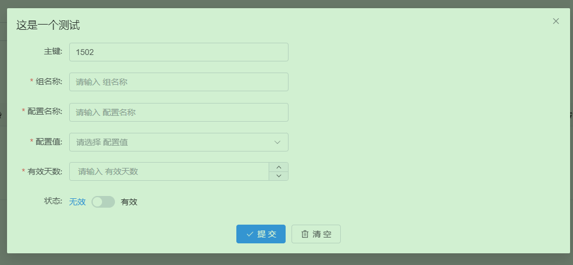

## 项目背景

作为一个后端小伙伴，最大的痛点就是写完的接口需要拥有一些可视化的页面去承载这些功能使用【如果是只给后端那么swagger也足够了，非后端有点呛】如果有专业前端去弄确实也快，但是小公司呀~~~

学呗~妈呀，现在的前端也挺卷，vue3啊element-ui呀typescript啊vite啊`【我其实只想要一个简单的页面维护数据】`

了解到[AVue](https://avuejs.com/)之后，觉得挺不错，降低不少门槛。内置的组件还挺多，嗯，不错。如果能把这种能力赋能给后端就更好了。

## 💡 为什么需要它？

- 后端写完接口后，**不想写前端**又需要数据维护页面？
- 小团队没有专业前端，**自己学Vue/TS太头疼**？
- 想用最简单的方式实现增删改查界面？试试**注解驱动**的AVue集成方案！

## ✨ 核心优势

✅ **零前端基础**：不用搭前端环境，SpringBoot项目直接集成  
✅ **注解即页面**：Java注解定义表单，自动生成可视化CRUD  
✅ **5分钟速成**：从实体类到完整页面，一杯咖啡的时间搞定  
✅ **丰富组件库**：输入框/下拉选择/文件上传/JSON编辑器...全都有  
✅ **无缝兼容**：支持SpringBoot 2.x/3.x，JDK8+

> 如果你有后端一些基础功能需要简单的页面维护、又不想单独搞一套前端环境、可以尝试体验一下。

## 如何使用?

### 1、clone 项目

### 2、编译项目

```shell
mvn install 
```

### 3、客户端引入依赖

```xml
<dependency>
    <groupId>com.liukx.spring</groupId>
    <artifactId>spring-avue-starter</artifactId>
  <version>2.0.0-SNAPSHOT</version>
</dependency>
```

### 4、启用注解

```java
@EnableAVue(basePackages = {"你的模版路径"}, enumsPackages = {"你的枚举路径"})
```

- **模版类路径指定【必填】**
- 枚举类路径指定【非必填】 : `enumsPackages` 、 `enumsPackagesClasses`
- 静态资源指定【非必填】: `jsonResourceDir`

开启avue的接口扫描能力

### 5、定制模版

案例整体参考测试用例... `com.liukx.spring.client.model`

### 6、访问路径

> 端口号请更换成你的项目端口号

| 路径地址                                                        | 路径描述                    |
|-------------------------------------------------------------|-------------------------|
| http://localhost:9403/avue/server-crud?group=你的模版groupKey   | 查看crud的列表页面             |
| http://localhost:9403/avue/avue-component?group=avueUrlList | 所有avue的路由模版卡片列表         |
| http://localhost:9403/avue/list                             | 所有avue的路由模版卡片列表[上面的简化版] |

以上步骤即可渲染出增删改查页面，内置丰富的组件能力。[详细参考AVue的crud](https://avuejs.com/crud/crud-doc.html)

## 模版测试介绍

### 单个实体进行测试

`com.ruoyi.client.handler.AVueAnnotationHandlerTest` : 可针对单个实体进行测试得到JSON字符串.

### 整体测试

`com.ruoyi.client.RuoYiClientTestApplication` : 针对整个client配置进行测试

### 1、简单的模版

`com.liukx.spring.client.model.AVueSimpleModel`

```java
@AVueRouteKey(groupKey = "test-config")
@AVueCrudOption(title = "这是一个测试")
// 增删改查的接口定义
@AVueConfig(list = AVueConfigControllerTest.LIST_URL, update = AVueConfigControllerTest.UPDATE_URL, save =
// 返回结果定义
        AVueConfigControllerTest.UPDATE_URL, successKeyword = "true", successField = "success", messageField = "message")
public class AVueSimpleModel {

    @AVueInput(prop = "id", label = "主键", addDisplay = false, row = true, editDisabled = true, search = true)
    private String id;

    @AVueInput(prop = "configGroup", label = "组名称", search = true, row = true, rules = {
            @AVueRule(required = true, message = "组名称要填咧"), @AVueRule(min = 5, max = 10, message = "我跟你讲最小5个,最大10个.")})
    private String configGroup;

    @AVueInput(prop = "configName", label = "配置名称", search = true, required = true, row = true)
    private String configName;

    @AVueSelect(prop = "configCode", label = "配置值", dicData = "StatusEnums", search = true, required = true, row = true)
    private String configCode;

    @AVueNumber(prop = "validDay", label = "有效天数", search = true, required = true, row = true)
    private Integer validDay;

    @AVueSwitch(prop = "status", label = "状态", dicData = "StatusEnums", row = true)
    private int status;

}
```

#### **对应的展示效果**


### 2、复杂的模版

test目录下 : `com.ruoyi.client.model.AVueCrudModel`

```java
// 每个模版的标识,根据该标识路径能访问到该地址
@AVueRouteKey(groupKey = "test-route", title = "复杂模版路由", description = "这个是用来处理一些比较复杂的模版，里面涵盖了crud，按钮，以及后端的接口路径的定义，包括分页的参数设置等等一系列的demo操作", img = "https://gw.alipayobjects.com/zos/rmsportal/WdGqmHpayyMjiEhcKoVE.png")
// 表格的标题,整个CRUD的配置,和table渲染相关的
@AVueCrudOption(title = "这是一个复杂的模版", dialogClickModal = true, dialogDrag = true, border = true, viewBtn = true)
// 构建自己的页面自定义数据结构
//@AVuePage(pageData = "data", pageNumber = "pageNo", pageSize = "pSize", pageTotal = "pageTotal")
// 适配后台服务的对应的处理接口
@AVueConfig(list = AVueControllerTest.LIST_URL, update = AVueControllerTest.UPDATE_URL, save = AVueControllerTest.UPDATE_URL, successKeyword = "true", successField = "success", messageField = "message")
// 设置后台接口调用之后成功或者失败的结构模型
@AVueEventButtons(
        // 每一行的按钮及事件定义
        tableRowButtons = {
                // 指定方法名称按钮事件名称
                @AVueClickButton(methodName = AVueJsFunctionEnum.confirmClickRemoteApi, btnName = "确认按钮", attrExt = {
                        @AVueAttr(name = "title", value = "小伙子，你确定吗？有惊喜喔!"),
                        @AVueAttr(name = "url", value = AVueControllerTest.BODY_URL)}),
                // 指定事件
                @AVueClickButton(type = "success", btnName = "弹层按钮测试", methodName = AVueJsFunctionEnum.openWindowJsonRemote, attrExt = {
                        // 当前弹层的提交路径
                        @AVueAttr(name = "submitUrl", value = AVueControllerTest.BODY_URL),
                        // 找下一个模版
                        @AVueAttr(name = "group", value = "test-config"),
                        // 由于不是同一套模版，允许将数据结构进行转换填充。这里指定关系
                        @AVueAttr(name = "fieldConvertMap", value = "dataJson=configJson&&age=validDay")
                }),
                // 指定事件
                @AVueClickButton(type = "success", btnName = "复制拓展字段", methodName = AVueJsFunctionEnum.copyField, attrExt = {
                        // 当前弹层的提交路径
                        @AVueAttr(name = "name", value = "dataJson"),
                }),
                // 指定事件
                @AVueClickButton(type = "success", btnName = "复制行", methodName = AVueJsFunctionEnum.copyField)
        },
        // 左上角按钮事件
        tableTopLeftButtons = {
                @AVueClickButton(methodName = AVueJsFunctionEnum.hrefClick, btnName = "跳转链接", type = "success", icon = "el-icon-setting", attrExt = {
                        @AVueAttr(name = "url", value = "https://www.baidu.com")})
        }
)
public class AVueCrudModel {

    /**
     * 注解介绍
     *
     * @AVueInput: 组件类型以@AVue开始，后面是具体的组件。
     * - input  ： 代表文本框
     * - select ： 代表选择框
     * - number ： 代表数字框
     * - json   ： 代表json组件
     * <p>
     * 属性介绍：
     * addDisplay       ： 表示新增的时候是否展示
     * editDisabled     ： 表示修改的时候是否不可编辑
     * search           ： 代表列表页是否为搜索条件
     * searchRequired   ： 代表搜索条件是否为必填
     * dicData          ： 代表枚举字典
     * dicUrl           ： 代表后台拉取对象
     * 具体属性释义可参考 :  <a href="https://avuejs.com/views/doc.html">...</a>
     * 注解文档参考 : <a href="https://gitee.com/liukaixiong/RuoYi-AVue-Plus/blob/master/doc/annotation.md">...</a>
     */
    @AVueInput(prop = "id", label = "主键", addDisplay = false, editDisabled = true, search = true)
    private String id;

    @AVueInput(prop = "username", label = "用户名称", search = true, searchRequired = true, onClick = "testB")
    private String username;

    // 普通枚举
    @AVueSelect(prop = "checkStatus", label = "认证状态", dicData = "CheckStatusEnums", search = true)
    private String checkStatus = CheckStatusEnums.FOOTBALL.getCode().toString();

    @AVueSelect(prop = "likeStar", label = "喜欢明星", dicData = "test-likeStar-map")
    private Integer likeStar;

    @AVueSelect(label = "远端字典", dicUrl = "http://localhost:8765" + AVueControllerTest.DIC_URL, props = "{'label':'label','value':'value','res':'data'}", dicMethod = "post", dicQuery = "{'key':'key'}", search = true)
    private String remoteDic;
    /**
     * 联动 省市区
     */
    @AVueSelect(label = "省份", cascader = {"city"}, dicUrl = "https://cli.avuejs.com/api/area/getProvince", props = "{'label':'name','value':'code'}", dicMethod = "get", dicQuery = "{'key':'key'}", search = true)
    private String province;
    @AVueSelect(label = "城市", cascader = {"area"}, dicUrl = "https://cli.avuejs.com/api/area/getCity/{{key}}?province={{province}}", props = "{'label':'name','value':'code'}", dicMethod = "get", dicQuery = "{'key':'key'}", search = true)
    private String city;
    @AVueSelect(label = "地区", dicUrl = "https://cli.avuejs.com/api/area/getArea/{{key}}?city={{city}}", props = "{'label':'name','value':'code'}", dicMethod = "get", dicQuery = "{'key':'key'}", search = true)
    private String area;

    @AVueNumber(prop = "age", label = "年龄", labelTip = "这是选择年龄的地方")
    private Integer age = 18;

    @AVueRadio(prop = "sex", label = "性别", border = true, dicData = "SexEnums")
    private int sex = (int) SexEnums.UNKNOWN.getCode();

    @AVueDatetime(prop = "validDate", label = "有效时间")
    private Date validDate;

    @AVueTime(prop = "time", label = "时分秒选择")
    private Date time;

    @AVueTimeRange(prop = "timeRange", label = "时分秒范围", rangeSeparator = "-")
    private List<String> timeRange;

    @AVueDateRange(prop = "dateRange", rangeSeparator = "-", label = "日期范围", searchRange = true, search = true)
    private List<Date> dateRange;


    @AVueCheckbox(prop = "interest", label = "兴趣爱好", dicData = "InterestEnums")
    private List<String> interest;

    @AVueSwitch(prop = "status", label = "状态", dicData = "StatusEnums")
    private int status;

    /**
     * 单图上传
     */
    @AVueUpload(prop = "image", label = "单图上传", listType = "picture-img", action = "/upload", propsHttp = @AVueUploadPropsHttp(res = "single", name = "fileName"))
    private String image;

    /**
     * 多图上传
     */
    @AVueUpload(prop = "imageList", dataType = "array", listType = "picture-card", label = "单图上传", action = "/upload", propsHttp = @AVueUploadPropsHttp(res = "single", name = "fileName"))
    private List<String> imageList;

    /**
     * json组件
     */
    @AVueJson(prop = "dataJson", label = "拓展字段")
    private String dataJson;

    /**
     * 支持模版嵌套
     */
    @AVueDynamic(prop = "simpleModel", label = "子表单测试")
    private AVueNodeModel simpleModel;

    /**
     * 支持分组类型
     */
    @AVueGroup(prop = "groupModel", label = "分组测试1")
    private AVueNodeModel groupModel;

    @AVueGroup(prop = "groupModel2", label = "分组测试2")
    private AVueNodeModel groupModel2;
}
```

#### 展示效果


点击弹层按钮测试



更多测试案例:`com.liukx.spring.client.model`

### 3. 配置项

`spring-avue-starter/src/test/resources/application.yml`

```yaml
spring:
  avue:
    debug: true  # 开发环境开启调试模式，IDEA-> Build -> Rebuild 模版类即可立即生效
    enable-login: true  # 是否开启登录模式
    username: admin     # 登录帐号
    password: 1234      # 登录的密码
```

####   

## 📚 拓展资源

- 本地调试文档
- 开发文档
  - [开发介绍](./doc/develop.md)
  - [拓展点](./doc/ext.md)
    - 静态资源配置介绍
    - 如何编写一个新的组件【前后端】

##### 💬 遇到问题？联系作者： 📱 微信 `liukaixiong820` 📧 QQ `444368875`


